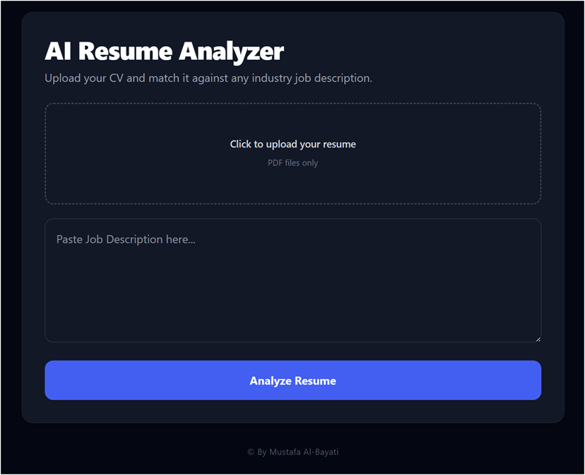

# AI Resume Analyzer

A web application that compares a user's resume against a specific job description. The app parses the uploaded PDF resume, extracts the text, and analyzes it against the job criteria to provide a match score, breakdown of strengths, missing skills, and actionable ATS tips.

---

## Application Preview & website 
https://ai-resume-analyzer-xi-plum.vercel.app/ 



---

## Features

* **PDF Parsing:** Extracts and sanitizes text cleanly from professional PDF resumes.
* **Intelligent Analysis:** Powered by Google Gemini to break down job qualifications vs candidate history.
* **Actionable Feedback:** Returns an ATS optimization score, core strengths, missing technical keywords, and suggestions for improvements.
* **Modern Interface:** Built with a clean, minimal UI using React and Tailwind CSS.

---

## Tech Stack

* **Frontend:** React, Vite, Tailwind CSS, Axios
* **Backend:** Node.js, Express, Multer, PDF-Parse
* **AI Engine:** Google Generative AI (gemini-2.5-pro)

---

## Local Setup Instructions

### 1. Clone the Repository
```bash
git clone [https://github.com/must-Zeus0036/AI-Resume-Analyzer.git](https://github.com/must-Zeus0036/AI-Resume-Analyzer.git)
cd AI-Resume-Analyzer
